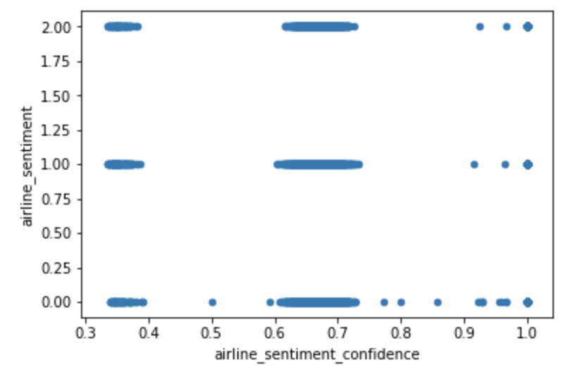
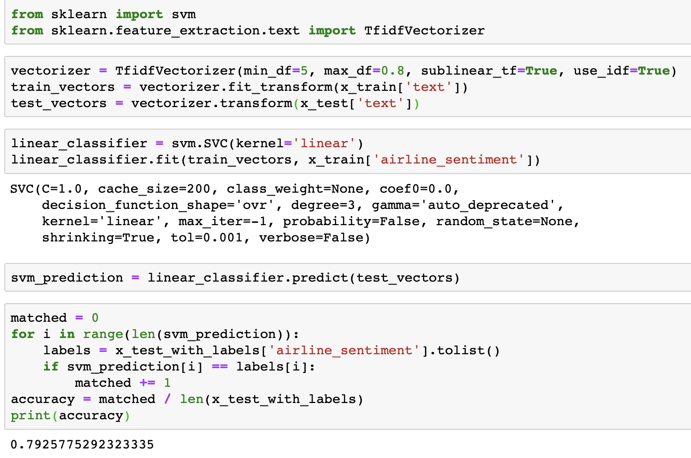

# Sentiment Analysis of Airline Twitter Data

### Anuraag Govindarajan, Edward Han, Parker Bryant, Sai Gogineni

#### Motivation

Twitter (social media) is an abundant source of information with high level figures like the President of the United States using it as a platform to spread their policies and beliefs. On a lower level, there are 321 million active users as of February 2019.

Social Media and big data go hand-in-hand because of the amount of user-generated content. Using data from a platform such as Twitter, we are exposed to a broad range of topics, which allows us to go down several possible paths for analysis. Several people in the past have worked on mining Twitter tweets. For example, some projects include analyzing the sentiment surrounding a movie on twitter and comparing that sentiment to actual critic and user reviews of the same movie.

Our specific project deals with sentiment surrounding airlines. We are trying to answer the following question: Is there a reliable way to categorize the sentiment of massive amounts of tweets regarding a certain subject? If we can predict sentiment of a given tweet or group of tweets about an airline to a reasonable degree of accuracy, our project could potentially be useful for both PR companies and customers. Both will have a better understanding of what airlines need to have to be satisfactory. If we are successful in achieving these goals, our project could be generalizable to determine twitter sentiment about any corporation, not just airlines.

#### Dataset

We picked our dataset from Kaggle. It seemed favorable because it had a decent number of tweets, each one with an accompanying sentiment. We were able to use this as a base for our supervised learning project. The dataset itself has approximately 14,000 tweets, as well as 15 features for each tweet. There were some strange features that we decided to discard from our analysis immediately, such as “negative reason gold” and “airline sentiment gold”, and there were some features we simply decided had no impact on the sentiment of the tweet, such as the name of the person who made the tweet. The features we were left with after filtering included Tweet ID, Airline Sentiment, Airline Sentiment Confidence, Negative Reason, Airline, Retweet Count, Text, User Timezone, and Date/Time of Tweet. Upon further analysis, we determined that the features retweet count and airline sentiment confidence had little to no correlation with actual airline sentiment, so we decided to drop those from our analysis as well. This still left us with plenty of features to conduct analysis with, and it allowed us to experiment with data visualization and correlation calculations to determine which features had the most impact on sentiment.

You can see below a graph that illustrates the correlation between airline sentiment and airline sentiment confidence, another feature provided in the dataset:

#### Approach

We decided to use the Naive Bayes Classifier to classify our tweets into negative, neutral, or positive categories. The Naive Bayes Classifier relies on Bayes Theorem and probabilistic known background to calculate posterior probability. It is a specific form of Natural Language Processing, which combines AI and computational linguistics to help computers understand human patterns of speech. Ours is a supervised learning approach. Basically, our process includes preprocessing the data, building a vocabulary, creating feature vectors for each word, training the Naive Bayes Classifier on these feature vectors, and finally testing the remaining tweets using the trained Naive Bayes Classifier.

#### Preprocessing

This is kind of like the tweet cleaning section. When we are looking at tweets trying to determine sentiment, we generally know what is important and what can be filtered out with little to no effect. Words are the most important part of the tweets; they give the most insight into the potential sentiment, whereas something like punctuation does not. We cannot determine if an exclamation point is being used in a negative or positive sense without context, which is provided by words. We applied the preprocessing to the tweets in both the training and the test datasets. Our tweet preprocessing can be seen in the process_tweet function; it includes converting all text to lowercase, removing URLs, removing usernames, removing #s, and removing repeated characters in words. Additionally, there is a universal list of stop words, such as “the” or “and”, that are also removed from the tweets in the preprocessing section.

Below, you can see the effect of preprocessing on the actual text of the tweet. The column labeled "text" contains the original text, while the column lableed "new_text_2" contains the finalized, preprocessed tweet.

| tweet_id | airline_sentiment |	airline_sentiment_confidence |	negativereason |	negativereason_confidence |	airline |	retweet_count |	text |	tweet_created |	tweet_location |	user_timezone |	new_text | new_text2 |
| --- | --- | --- | --- | --- | --- | --- | --- | --- | --- | --- | --- | --- |
| 570306133677760513 |	1 |	1.0000 |	NaN |	NaN |	Virgin America |	0 |	@VirginAmerica Need to change reservation. Hav... |	2015-02-24 11:35:52 -0800 |	NaN |	Eastern Time (US & Canada) |	[@VirginAmerica, Need, change, reservation. h...] | [AT_USER, need, change, reservation, virgin, c...] |

| airline_sentiment | new_text2 |
| --- | --- |
| 1 | [AT_USER, need, change, reservation, virgin, c...] |

#### Building the Vocabulary and Creating Feature Vectors

This step starts with creating a list of all the words in our training set. Then, we break the list into word features, which is a dictionary of the distinct words in the list of all words, and the key for each dictionary value is the frequency of that word in the dataset. Next, we have to match our vocabulary against our tweets. This involves checking whether the words in our vocabulary are present in each tweet. From here, we were able to create our word feature vectors using the apply_features() function in the nltk library of Python. This function does the actual feature extraction.

#### Training and Testing the Classifier

Again, we were able to use the built in Naive Bayes Classifier in the nltk library of Python. We trained this classifier on the word feature vectors we calculated in the previous step, using only the training split of the data. This code can take several minutes to execute. Once the classifier is trained, we can use its classify function to predict the sentiment labels of the tweets in the test data. This code can also take several minutes to execute.

#### Experiments/Results

We split our data into train and test four different ways: (90% train, 10% test), (80% train, 20% test), (70% train, 30% test), and (60% train, 40% test). Below we show the results of the different experiments:

(Include some visualizations here)

The main way we evaluated our approach was through accuracy. Our original dataset has a sentiment value of negative, neutral, or positive for every tweet in the dataset. Although we created a test dataset that cannot see the sentiment for each tweet, we can still match the predicted sentiment with the sentiment for that tweet in the original dataset. We judged our performance based on the accuracy of the Naive Bayes Classification of the tweets. This calculation was simply the number of tweets in the test set in which the predicted sentiment equalled the original, actual sentiment divided by the total number of tweets in the test set.

The table above includes our results. As you can see the accuracies are in the mid to high 70’s for the most part. For perspective, if our model were completely random, or if it predicted the same sentiment for each tweet, the accuracy would be ~33%, so we consider our accuracies a significant improvement, though far from perfect. This simple metric also makes it easy to evaluate and compare other methods of classification. For example if we were to plug our preprocessed data into a Support Vector Machine instead of a Naive Bayes Classifier, we could simply compare our accuracies to see which Machine Learning Model yields better results.

While our main approach included the Naive Bayes Classifier and a lot of data preprocessing, we wanted to compare our methods to another approach, so we created a simple SVM Classifier using Python’s Sci-kit Learn library. We used the built-in vectorizer to vectorize all of the tweets in the dataset, and we used the same train/test split method. Accuracy was calculated the same way, so we were able to easily compare the results of predicting sentiment using a Naive Bayes Classifier and using a Support Vector Machine. You can see the SVM below:

#### Conclusion

Our project elucidates how we can use Natural Language Processing to make computerized conclusions about text. Once more accurate models are created, the applications will be incredibly broad and effective. The airline industry is only one category out of countless that can benefit from Machine Learning Models such as this one. With the model we’ve created here, if it was given the appropriate training data, it should be able to use the same methods and generate sentiment predictions for any topic, whether it be airlines, cars companies, hospitals, coffee shops, etc.

#### Citations

